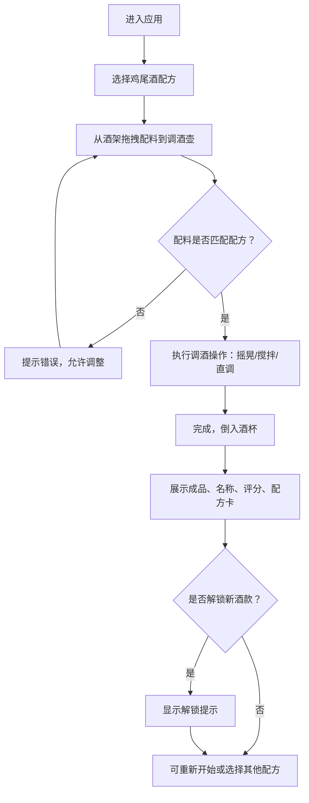

## 1. 产品概述

虚拟调酒台是一款趣味性互动 Web 应用，让用户在屏幕上体验鸡尾酒调制乐趣。用户通过拖拽配料、模拟调酒动作，完成经典鸡尾酒制作，并获得评分和解锁隐藏酒款。

- 目标用户：调酒爱好者、对鸡尾酒文化感兴趣的普通用户
- 产品价值：提供沉浸式、零成本的调酒体验，普及鸡尾酒知识

## 2. 核心功能

### 2.1 功能模块

1. **酒架展示区**：展示十几种基酒、果汁和配料图标，支持拖拽添加到调酒壶
2. **调酒壶操作区**：显示已添加配料及用量刻度，提供摇晃、搅拌、直调三种操作方式
3. **成品展示区**：展示完成的鸡尾酒外观、名称、配方卡和口感描述
4. **配方系统**：内置多款经典鸡尾酒配方，自动判断配料匹配度并评分

### 2.2 页面详情

| 页面名称 | 模块名称 | 功能描述 |
|---------|---------|---------|
| 主页面 | 酒架展示区 | 横向/网格排列配料图标，显示名称，支持拖拽或点击添加 |
| 主页面 | 调酒壶操作区 | 以绝对定位显示已添加配料列表及用量刻度，支持删除配料；根据配方要求显示摇晃/搅拌/直调操作按钮，用鼠标拖拽模拟操作动作 |
| 主页面 | 成品展示区 | 展示鸡尾酒成品图、名称、评分、配方卡和口感描述；支持重新开始 |
| 主页面 | 配方选择区 | 显示当前挑战配方，可切换不同鸡尾酒挑战 |

## 3. 核心流程

用户选择一款鸡尾酒配方 → 从酒架拖拽对应配料到调酒壶（显示用量刻度） → 系统判断配料是否正确 → 正确则进入调酒操作（摇晃/搅拌/直调） → 完成后展示成品、评分和配方卡 → 可解锁隐藏酒款

## 4. 用户界面设计

### 4.1 设计风格

- **主色调**：深酒红色 `#8B0000` 作为主色，金色 `#D4AF37` 作为强调色，深褐色 `#2C1810` 作为背景色
- **次色调**：暖橙色 `#E87722`、奶油白 `#FFF8E7`
- **整体风格**：奢华复古酒吧风，深色木纹质感背景，金色点缀边框，柔和暖色灯光氛围
- **按钮样式**：圆角金边按钮，悬停时微微发光，点击有按压反馈
- **字体**：标题使用优雅衬线字体（Playfair Display），正文使用简洁无衬线字体
- **图标风格**：扁平化彩色 SVG 图标，配以半透明玻璃质感容器
- **视觉特效**：液体流动动画、摇晃时的震动效果、完成时的金色粒子效果

### 4.2 页面设计概述

| 页面名称 | 模块名称 | UI 元素 |
|---------|---------|---------|
| 主页面 | 酒架展示区 | 深色木纹货架背景，配料以玻璃瓶图标展示，悬停时高亮发光，拖拽时半透明跟随鼠标 |
| 主页面 | 调酒壶操作区 | 中央大号调酒壶 SVG，配料以层叠液体形式显示在壶内，刻度标尺在侧面；操作按钮为金色圆角按钮，带摇晃/搅拌动画 |
| 主页面 | 成品展示区 | 高脚杯 SVG 根据鸡尾酒显示不同颜色液体，配方卡为金色边框羊皮纸风格卡片 |
| 主页面 | 配方选择区 | 顶部横向排列可选鸡尾酒缩略图，当前选中项金色高亮 |

### 4.3 响应式

- 桌面端优先设计，采用横向三栏布局（酒架 - 调酒区 - 成品区）
- 平板端自动调整为上下布局
- 移动端优化触摸拖拽操作，简化布局为垂直堆叠
