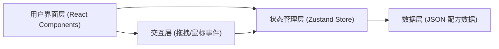

## 1. 架构设计



## 2. 技术描述

- **前端框架**：React 18 + TypeScript + Vite
- **样式方案**：Tailwind CSS 3
- **状态管理**：Zustand
- **图标库**：lucide-react
- **初始化工具**：vite-init
- **后端**：无（纯前端应用）
- **数据存储**：本地 JSON 配方数据

## 3. 路由定义

| 路由 | 用途 |
|-----|-----|
| / | 主页面：虚拟调酒台（单页应用，无路由切换） |

## 4. 数据模型

### 4.1 类型定义

```typescript
// 配料类型
interface Ingredient {
  id: string;
  name: string;
  nameEn: string;
  type: 'spirit' | 'liqueur' | 'juice' | 'syrup' | 'garnish' | 'other';
  color: string;
  icon: string;
}

// 已添加的配料（带用量）
interface AddedIngredient extends Ingredient {
  amount: number; // 毫升
  order: number;  // 添加顺序
}

// 配方配料要求
interface RecipeIngredient {
  ingredientId: string;
  amount: number;      // 标准用量 ml
  tolerance: number;   // 允许误差 ml
}

// 调酒操作类型
type MixAction = 'shake' | 'stir' | 'build';

// 配方
interface Recipe {
  id: string;
  name: string;
  nameEn: string;
  description: string;   // 口感描述
  ingredients: RecipeIngredient[];
  action: MixAction;
  actionDuration: number; // 操作需要的次数/时间
  glassType: string;       // 酒杯类型
  color: string;           // 成品颜色
  garnish: string;         // 装饰物
  isHidden?: boolean;      // 是否隐藏酒款
  unlockCondition?: string; // 解锁条件
}

// 游戏状态
type GamePhase = 'selecting' | 'adding' | 'mixing' | 'finished';

// 评分结果
interface ScoreResult {
  score: number;
  maxScore: number;
  accuracy: number;
  unlockedRecipe?: string;
}
```

### 4.2 配方数据结构

```json
{
  "ingredients": [
    {
      "id": "gin",
      "name": "金酒",
      "nameEn": "Gin",
      "type": "spirit",
      "color": "#F0F8FF",
      "icon": "🍸"
    }
  ],
  "recipes": [
    {
      "id": "mojito",
      "name": "莫吉托",
      "nameEn": "Mojito",
      "description": "清爽薄荷与青柠的完美结合，古巴经典鸡尾酒。",
      "ingredients": [
        { "ingredientId": "rum-white", "amount": 60, "tolerance": 5 },
        { "ingredientId": "lime-juice", "amount": 30, "tolerance": 3 }
      ],
      "action": "shake",
      "actionDuration": 15,
      "glassType": "highball",
      "color": "#98FB98",
      "garnish": "薄荷叶 + 青柠片"
    }
  ]
}
```

## 5. 组件结构

```
src/
├── components/
│   ├── LiquorShelf/        # 酒架组件
│   │   └── IngredientItem.tsx
│   ├── MixingArea/         # 调酒壶操作区
│   │   ├── CocktailShaker.tsx
│   │   ├── IngredientList.tsx
│   │   └── MixActions.tsx
│   ├── ResultArea/         # 成品展示区
│   │   ├── CocktailGlass.tsx
│   │   ├── RecipeCard.tsx
│   │   └── ScoreDisplay.tsx
│   └── RecipeSelector/     # 配方选择器
│       └── RecipeSelector.tsx
├── data/
│   └── recipes.json        # 配方和配料数据
├── hooks/
│   └── useDragDrop.ts      # 拖拽逻辑
├── store/
│   └── useCocktailStore.ts # Zustand 状态管理
├── types/
│   └── index.ts            # 类型定义
├── utils/
│   └── scoring.ts          # 评分逻辑
├── App.tsx
├── main.tsx
└── index.css
```

## 6. 核心交互实现

1. **拖拽系统**：使用原生 HTML5 Drag and Drop API 或自定义鼠标事件实现配料拖拽
2. **调酒动作模拟**：
   - 摇晃(Shake)：按住鼠标快速左右移动，累计移动距离达到要求
   - 搅拌(Stir)：按住鼠标绕圆心做圆周运动，累计圈数达到要求
   - 直调(Build)：直接点击完成，无需复杂操作
3. **配方校验**：对比已添加配料与配方要求，计算匹配度评分
4. **动画效果**：使用 CSS Keyframes 和 React state 控制液体晃动、震动、粒子效果
